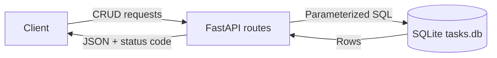
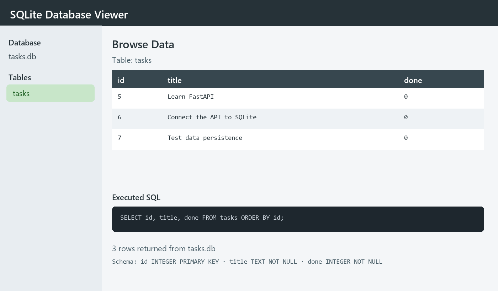

# BE-02 - Connect CRUD to the Database

> This directory is a disclosed copy of the BE-02 project from the FlyRank internship repository. SafeBump uses it as a controlled dependency-upgrade target; it was not created as new capstone work.

A FastAPI task service backed by SQLite. It preserves the CRUD API contract while moving state from process memory into a durable database file.

[View the source internship portfolio](https://github.com/bilgenurpala/flyrank-internship/tree/main/backend-engineering/be-02)

## Architecture



The client does not need to know whether tasks live in memory or SQLite. Persistence is an implementation detail behind the same HTTP interface.

## Tech Stack

- Python 3.10+
- FastAPI and Uvicorn
- Python `sqlite3`
- Pytest

## Why SQLite

SQLite stores the entire database in one file, needs no separate server, and ships with Python. Unlike an in-memory list, it preserves tasks after the API process stops or restarts.

## Project Structure

```text
be-02/
├── database.py
├── main.py
├── test_main.py
├── requirements.txt
├── docs/
│   └── database-view.png
└── sql/
    └── stage-4.sql
```

`tasks.db` is created automatically beside the application and ignored by Git. A clean clone starts with a new local database.

## Setup and Run

```bash
cd backend-engineering/be-02
python -m venv .venv
```

Windows:

```bash
.venv\Scripts\activate
```

macOS or Linux:

```bash
source .venv/bin/activate
```

```bash
pip install -r requirements.txt
uvicorn main:app --reload
```

The API starts at `http://127.0.0.1:8000`; Swagger UI is at `http://127.0.0.1:8000/docs`.

At first startup the app creates the `tasks` table and inserts three example tasks only when the table is empty.

## API Reference

| Method | Path | Success | Validation | Missing ID |
|---|---|---:|---:|---:|
| GET | `/tasks` | 200 | - | - |
| GET | `/tasks/{id}` | 200 | - | 404 |
| POST | `/tasks` | 201 | 400 | - |
| PUT | `/tasks/{id}` | 200 | 400 | 404 |
| DELETE | `/tasks/{id}` | 204 | - | 404 |

## CRUD Example

```bash
curl -i -X POST http://127.0.0.1:8000/tasks \
  -H "Content-Type: application/json" \
  -d "{\"title\":\"Review SQLite queries\"}"

curl -i -X PUT http://127.0.0.1:8000/tasks/1 \
  -H "Content-Type: application/json" \
  -d "{\"title\":\"Learn SQLite\",\"done\":true}"

curl -i -X DELETE http://127.0.0.1:8000/tasks/1
```

Unknown task IDs return `{"error":"Task not found"}`. Invalid create requests return `{"error":"Title is required"}`.

## Persistence and SQL Safety

Every CRUD operation uses `?` placeholders and passes values separately. User input is never concatenated into SQL text.

To prove persistence, create a task, restart Uvicorn, and call `GET /tasks`. The task remains available because it lives in `tasks.db` rather than process memory.

## Database View



The screenshot shows the generated schema and the same rows returned by the API.

## SQL Exploration

Stage 4 queries are saved in [`sql/stage-4.sql`](sql/stage-4.sql). For example:

```sql
SELECT * FROM tasks WHERE done = 1;
```

After `UPDATE tasks SET done = 1`, the updated state is visible immediately through `GET /tasks` because direct SQL and the API share one source of truth.

## Tests

```bash
pytest -q
```

The six tests cover one-time seeding, every CRUD operation, validation, missing resources, status codes, and persistence at the SQLite layer.

## What I Learned

- API behavior can remain stable while the storage implementation changes.
- Database initialization and idempotent seeding make clean-clone setup reliable.
- Parameter binding is the default defense against SQL injection.
- Persistence can be demonstrated through both HTTP and direct database inspection.

